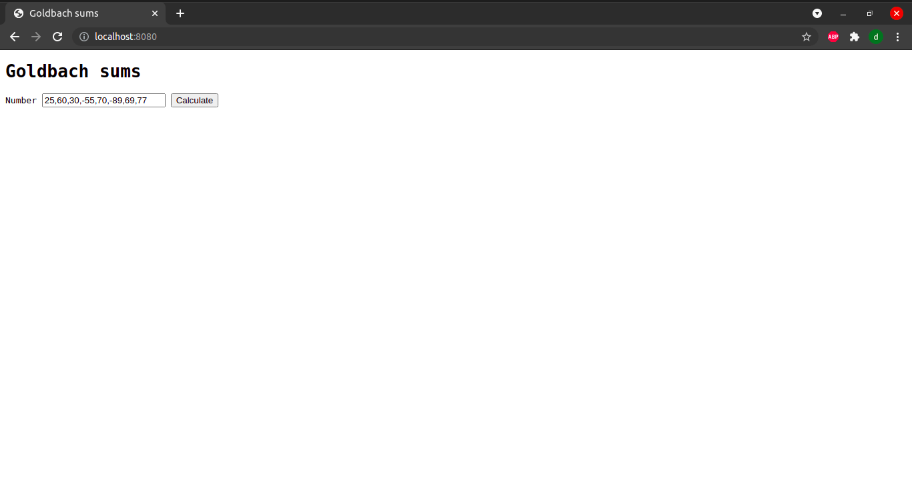
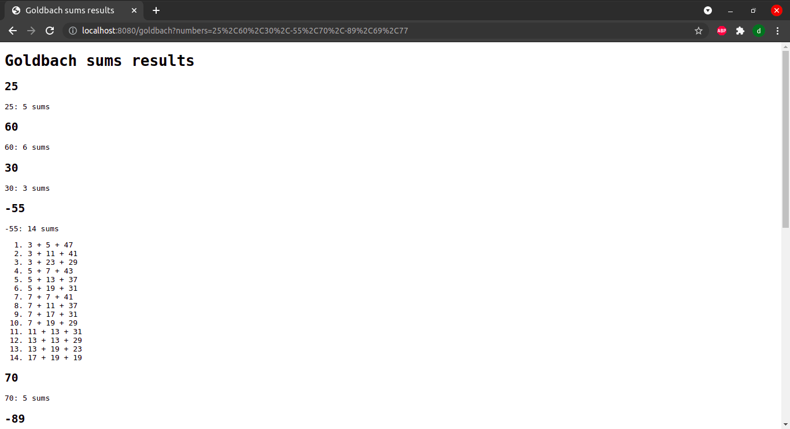

# Proyecto 1: Servidor concurrente de cálculo de sumas de Goldbach

#### Integrantes

B90807 David Atias
B94560 Gilbert Marquez
B80626 Kevin Arguedas

### Descripción del proyecto

Servidor web concurrente que permite al usuario calcular las sumas de goldbach de los números ingresados.
Para compilar el programa solo se debe ingresar el comando make desde la carpeta raiz del proyecto. Se puede ejecutar make release para compilar con optimizaciones del compilador.
Al ejecutar el programa se puede enviar como primer argumento el puerto y como el segundo la cantidad de consumidores que se quiere, lo cual equivale a la cantidad de conexiones que acepta el programa al mismo tiempo. Si no se brindan argumentos se utiliza el puerto 8080 y se pueden manejar diez conexiónes al mismo tiempo. Luego de ejecutar el programa debe accesar la conexión a traves de un navegador donde se debe accesar a la página localhost:8080 en el caso donde no se envíen argumentos, en otro caso se debe sustituir el 8080 por el puerto ingrasado como primer argumento. Luego de esto se cargará un página que tiene una caja de texto para ingresar el o los números de los que se quiere obtener las sumas de goldbach. Si se quiere ingresar varios números estos deben estar separados por un coma y sin espacios, luego se presiona el botón calculate y se cargará su consulta y aparecerá un página con el número solicitado y la cantidad de sumas. También se puede ingresar los numeros modificando la URI directamente, sin embargo los numeros deben estar separados por "%2C" que representan las comas.

### Requerimientos

  El servidor debe poder manejar varias peticiones al mismo tiempo (Debe tratar las conexiones de forma concurrente)
  Se debe responder con las sumas de goldbach que pida el usuario, la petición puede ser de una suma o de varias.

### Manual de usuario

  - Primero se debe correr el ejecutable del servidor cuyo nombre es igual a la carpeta del proyecto. Recibe 2 parámetros:
    1. Puerto desde el cual se recibirán las solicitudes de conexión
    2. Cantidad de conexiones simultáneas que permite la aplicación
    * Los parametros deben ser exactamente **2 valores numéricos** en caso de no querer los valores por defecto, de lo contrario, no se ejecutará el programa 
  
  - Para ingresar a la aplicación, se debe ingresar a https://localhost:PUERTO, donde PUERTO corresponde al primer parámetro ingresado o 8080 en caso de dejar el valor por defecto

  - Para obtener calcular las sumas de goldbach de un número, este debe ser ingresado en la caja de texto, y seguidamente se presiona "calculate". En caso de que sean múltiples números, estos deben ser ingresados separados por comas y sin espacios ni separadores de millares. Los números deben ser enteros.

  - Si se ingresa un número positivo, se mostrarán la cantidad de sumas de goldbach que tiene dicho número. Si el número ingresado es negativo, se procesará como positivo pero mostrando además las diferentes sumas de golbach del número en una lista ordenada.

### Ejemplo de uso

#### Entrada

#### Salida

