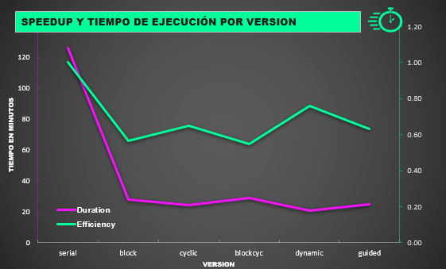
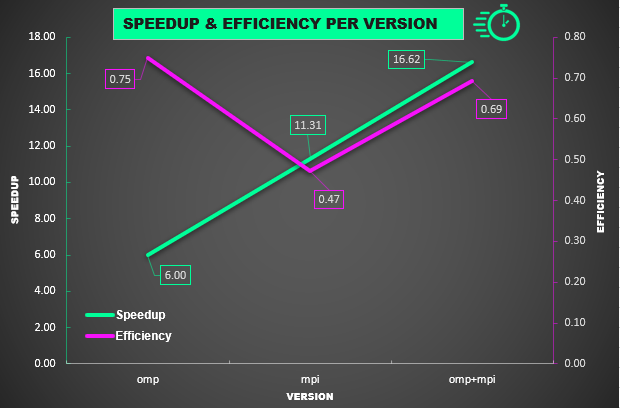

Copyright 2021 Rostipollos. Universidad de Costa Rica. CC BY 4.0
# Proyect 2: Enchanted forest

#### Integrants

B90807 David Atias
B94560 Gilbert Marquez
B80626 Kevin Arguedas

### Proyect description

The purpose of the proyecto is to work with a matrix representing a forest which could have three characters representing three types of objects: 'a' representing a tree, 'l' representing a piece of lake and '-' representing a piece of meadow. With each passing day the forest will change cell per cell acording to a set of rules regarding the up to eight cells surrounding it:
1. If the cell is a tree and it has at least four neighbors that are lake, then it will become lake.
2. If the cell is a lake and it has less than tree neighbors that are lake, then it will become meadow.
3. If the cell is a meadow and it has at least tree neighbors that are tree, then it will become a tree.
4. If the cell is a tre and it has more than four neighbors that are tree, then it will become a meadow.
5. If anything else happends the cell will remain the same.
The point is to receive a file job0xx.txt with the name of files containing a map to work with and a number of days it wants to simulate. If the number given is positive then it produces the result of each forest for each day, if it is negative only creates the forest for the last day. The maps are a file map0xx.txt where in the first line it says the number of rows and columns, and the following lines are the characters arrange to form the matrix(according to the rows and columns given). The program produces a file named map0xx-n.txt where the 'x' is the number of the original map and the 'n' is the result passed n nights.
	Examples:
1. job001.txt:
map001.txt 2
map002.txt -100
map003.txt -20000

2. map001.txt:
<pre>
7 7
-------
-l--l--
-ll----
-l-----
---laa-
-aa-al-
a-a----
</pre>
3. map001-1.txt:
<pre>
-------
-------
-ll----
-------
----aa-
-aaaa--
aaaa---
</pre>

### Compiling

This proyect comes with a Makefile that has everything you need to compile it just use the command make in the proyect folder on a terminal terminal.

### User manual

After compiling execute forest in a terminal followed by a space and the path to the job0xx.txt and the program will create a folder named "output" where the results of the requested maps through the job file are saved.
Example: ./bin/forest test_set_1/input/job001.txt
Its important to remember that the file job needs to follow a format explained in the proyect description with the respective maps following their own format in the same route.

### Performance analysis

In order to optimize the solution of our problem, we'll perform performance measurements with the following mappings: block, cyclic, block cyclic, dynamic, and guided. Later, we'll compare the mapping types and discuss the conclusions. We'll execute every version of the code three times and take the faster execution time to make our conclusions.

1) Performance of the serial version.

 After executing the serial version 3 times, taking the faster, our execution time was 7560.534 seconds (2 hours and 6 minutes aprox).

2) Parallelization of the code.

 To parellelize the code we'll use OpenMP directives. Due to the structure of our program, the maps are iterated and modified in a "for" cycle. So, our desing will consist in the use of a "Parallel for" to distribute these iterations between threads.
 
  2.1) Performance of parallel with static mapping verions.
  
   Since the problem will be subdivided between threads, we expect that these performances will be better than the one of the serial version. However, because these following versions use static mapping, the execution will be as fast as the slowest thread, so one thread may have a heavy workload compared to the other threads. Then, we can't predict which of the following versions will have a better performance, because that depends of the type of static mapping used and the order of the maps.

  2.1.1) Block mapping.
  
   In this version our execution time was 1668.851 seconds (28 minutes aprox).With these results, we can conclude that this version has a better performance than the serial version, as we expected.

  2.1.2) Cyclic mapping.
  
   In this version our execution time was 1460.746 seconds (24 minutes aprox). With these results, we can conclude that this version has a better performance than the serial version, as we expected. Also, has a better performance than the parallel version using block mapping.
  
  2.1.3) Block cyclic mapping.
   
   In this version our execution time was 1724.351 seconds (29 minutes aprox). With these results, we can conclude that this version has a better performance than the serial version, as we expected. Also, has a better performance than the parallel version using block mapping.

  2.2) Performance of parallel with dynamic mapping verions.
  
   We expect that these performances will be better than the serial's version performance (cause the problem will be subdivided between threads) and the ones using static mapping. This second conjecture is because the dynamic mapping allows us to "avoid" the problem that occurs when a heavy workload is given to one or some specific threads, so makes the distribution of tasks more efficient.
  
  2.2.1) Dynamic mapping.

   In this version our execution time was 1247.284 seconds (21 minutes aprox). With these results, we can conclude that this version has the best performance of all the mappings, which was expected (we tought that competing with the guide mapping).

  2.2.2) Guide mapping.

   In this version our execution time was 1494.211 seconds (25 minutes aprox). With these results, we can conclude that this version has a better performance than the serial version, as we expected. Also, has a better performance than the version using block mapping and worse than the dynamic mapping version. Surprisingly, it has a slightly worse performance than the static cyclic mapping version, something that we weren't expecting.

   

  As we expected, dynamic mapping had the fastest execution time, probably due to how different work units were. Dynamic mapping was the most efficient as well, as all the parallel version used the same amount of threads, then the fastest is also the most efficient. However, this results depend a lot on the input, as the size of the work units could affect which mapping method works better. For job002 input, dynamic mapping is clearly the fastest and most efficient.

  ### Distributed performance analysis

  With our design we improved greatly the execution time, lowering it to just a few minutes. As work units are big, dynamic mapping in the distributed part is more likely to have near optimal results. Work units being big could've increase the serial time of the process reducing the speedup, though. The program could be better with a different type of mapping in the concurrent part of the program, since our efficency depends entirely on the dimensions of the map.

  In the graph below we can see the speedup our three versions had. The 8-threaded omp implementation was the most efficient but also the slowest, most likely because of the amount of threads. The version that had best performance was the hybrid omp+mpi reducing the time to around three and a half minutes. 24 single-threaded processes in the mpi version also had a great speedup, however, it was slower than the mpi+omp version. This is probably because of the amount of maps, since the only way to have the 24 threads busy is to have at least 24 maps remaining. When less maps are left then concurrency reduces. 
  
  

  Times obtained:
  
  omp 1 thread: 3473.57s obtained multiplying the 8 thread time by 6. It's only an estimated to calculate the speedup and efficiency

  omp 8 thread: 578.93s

  mpi 24 processes: 307.03s

  omp+mpi 3 processes 24 threads: 208.94s

  
 