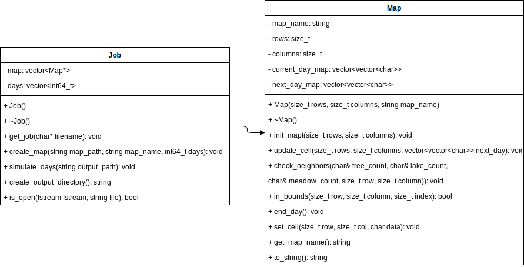
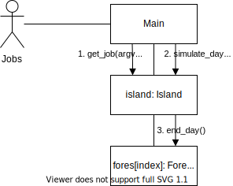

<!--- Copyright 2021 Rostipollos. Universidad de Costa Rica. CC BY 4.0 -->

The program is made so that the class Job is in control of the functionality, it recieves the input from main and makes the output, gets the information needed to work with and creates the maps requested with the days said in the input and the simulation of passing time, for this its dependant on the class Map to work with each one of the requested maps applying the rules to update the cells with the passing days. The handling of files and input is not shown on the pseudocode because is meant to solve the problem of simulating the map according to its rules.

The program distributes each map between the diferent threads. Only one thread is working on a map but several threads are working on several maps.

UML design:

 

Class interaction:

 

Pseudocode:

```cpp
simulate_days():
  parallel for
  for map_index := 0 to map_count do
    for day := 0 to days[map_index]
      map[map_index].end_day()
    end for
  end for
```
```cpp
end_day():
  next_day_map := current_day_map

  for row := 0 to row_count
    for column := 0 to column_count
      update_cell(row, col, next_day_map)
    end for
  end for
  current_day_map := address of next_day_map
```
```cpp
update_cell(row, column, next_day_map):
  tree_count := tree_neighbors()
  lake_count := lake_neighbors()
  meadow_count := meadow_neighbors()

  switch (map[row][columns])
    case 'a':
      if lake_count >= 4 then
        next_day_map[row][column] := 'l'
      else if tree count > 4 then
        next_day_map[row][column] := '-'
      else
        next_day_map[row][column] := 'a'
      end if
      break switch

    case 'l':
      if lake_count < 3 then
        next_day_map[row][column] := '-'
      else
        next_day_map[row][column] := 'l'
      end if
      break switch

    case '-':
      if tree_count >= 3 then
        next_day_map[row][column] := 'a'
      else
        next_day_map[row][column] := '-'
      end if
      break switch
```
