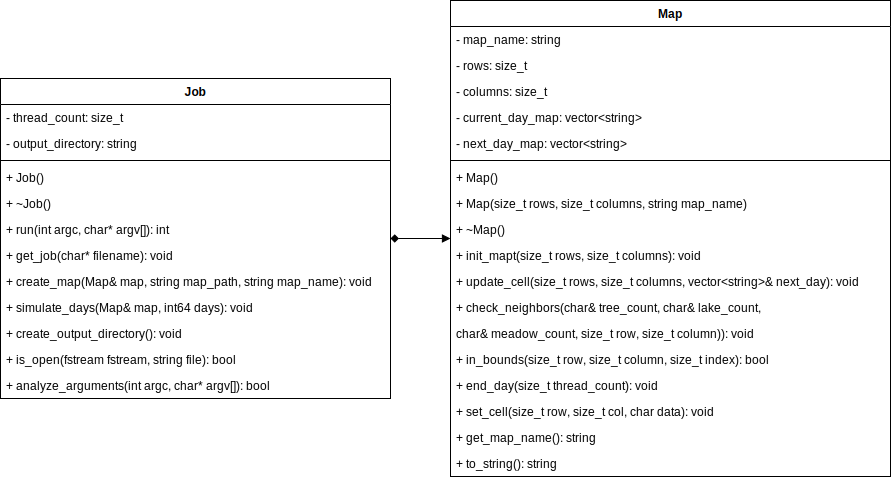
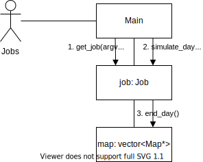

Copyright 2021 Rostipollos. Universidad de Costa Rica. CC BY 4.0

The program is made so that the class Island is in control of the functionality, it recieves the input from main and makes the output, gets the information needed to work with and creates the forests requested with the days said in the input and the simulation of passing time, for this its dependant on the class Forest to work with each one of the requested forests applying the rules to update the cells with the passing days. The handling of files and input is not shown on the pseudocode because is meant to solve the problem of simulating the forest according to its rules.

UML design:

 

Class interaction:

 

Pseudocode:

 

 

 

 